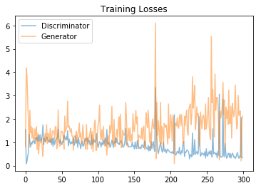

# Face_Generator-GAN

## Goal

The model is trained on the [CelebFaces Attributes Dataset](http://mmlab.ie.cuhk.edu.hk/projects/CelebA.html) (CelebA) which contains about 200000 celebrity images
[Dataset can be found here](https://s3.amazonaws.com/video.udacity-data.com/topher/2018/November/5be7eb6f_processed-celeba-small/processed-celeba-small.zip)

I Defined and trained a DCGAN on a dataset of faces. The Goal of this project is to generate new images of faces that look as realistic as possible.

The project is broken down into a series of tasks from loading in data to defining and training adversarial networks. At the end of the notebook, visualizing the results of your trained Generator to see how it performs; generated samples indeed look like fairly realistic faces with small amounts of noise

## Project Information

### Contents

- Intro
- Step 0: Import Datasets
- Step 1: Preprocess & Load the Data                                                           
- Step 2: Create Dataloader                                                       
- Step 3: Define Model (Discriminator & Generator)
- Step 4: Create complete network          
- Step 5: Train 
- Step 6: Generate Faces

### Architecture

### Training Graph

### Generated Faces after Training

### Question: What do I notice about the generated samples and how to improve this model?
Considering the following factors:

* The dataset is biased; it is made of "celebrity" faces that are mostly white
* Model size; larger models have the opportunity to learn more features in a data feature space
* Optimization strategy; optimizers and number of epochs affect your final result

### Answer:

 1. The training data does not have the complete face. Features like hairstyle & chins are not visible. As a results, the generated   images miss chins and complete hairstyle. Data should preferably have the complete face.

2. Obtaining higher resolution images as a dataset( Maybe 128x128 ) and then training the model on those images. (CelebA has 32x32 images)

3. DCGAN is not a typical network where reduction in loss will point towards a better model. I don't know why it isn't so I'm not sure if higher epochs makes the generaotor generate more accurate and realistic faces.

4. The dataset is biased. It is made of celebrity faces that are mostly white.Faces of people of All races and different countries should be included in the dataset. Also, we need to add more images in the dataset till it has almost equal number of white and non-white celebrity faces.

5. Model size matters. we have to ensure that our models reconginze and generate faces correctly. Deep models allow to catch some more characteristrics of the faces. For face generation task, we need to learn more complex features so we need a bigger network.

6. We can use different optimizers: SGD for the discriminator and keep Adam for the generator. Training for more epochs may also affect quality of final generated faces.

7. The photo angles are different. If all photos were taken from a similar angle it would have been easier for the network to train and to learn that faces are usually more or less symmetrical. (better feature extraction).
