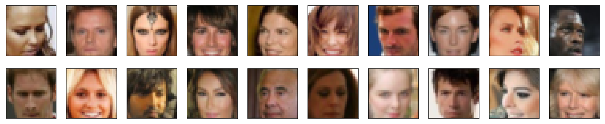
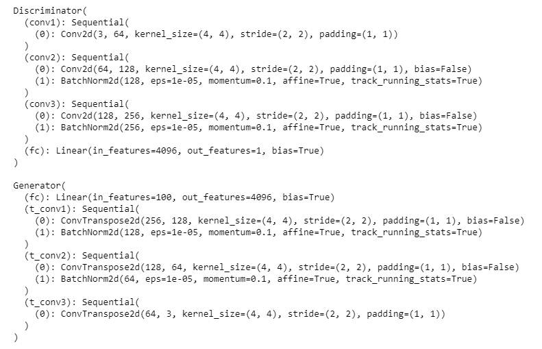
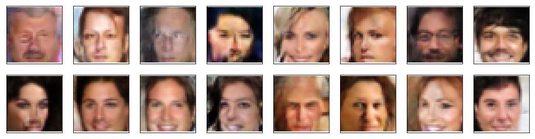

# Face_Generator-GAN

## Goal

The model is trained on the [CelebFaces Attributes Dataset](http://mmlab.ie.cuhk.edu.hk/projects/CelebA.html) (CelebA) which contains about 200000 celebrity images
[Dataset can be found here](https://s3.amazonaws.com/video.udacity-data.com/topher/2018/November/5be7eb6f_processed-celeba-small/processed-celeba-small.zip)

I Defined and trained a DCGAN on a dataset of faces. The Goal of this project is to generate new images of faces that look as realistic as possible.

The project will be broken down into a series of tasks from loading in data to defining and training adversarial networks. At the end of the notebook, you'll be able to visualize the results of your trained Generator to see how it performs; your generated samples should look like fairly realistic faces with small amounts of noise

## Project Information

### Contents

- Intro
- Step 0: Import Datasets
- Step 1: Preprocess & Load the Data                                                           
- Step 2: Create Dataloader                                                       
- Step 3: Define Model (Discriminator & Generator)
- Step 4: Create complete network          
- Step 5: Train 
- Step 6: Generate Faces

### Architecture

### Training Graph

### Generated Faces after Training

